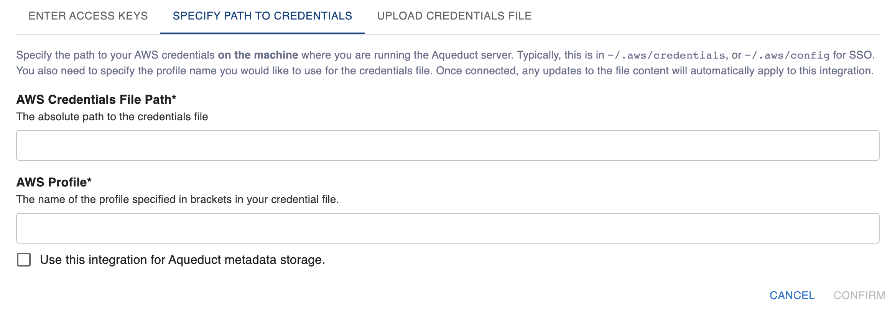

# Connecting to AWS S3

To connect to AWS S3, you need to provide the S3 bucket name, region, and access key credentials. Aqueduct supports two types of credentials: [#aws-iam-access-key](connecting-to-aws-s3.md#aws-iam-access-key) and [#aws-sso](connecting-to-aws-s3.md#aws-sso). Before connecting, make sure the set of credentials you're providing [has access to the S3 Bucket](https://docs.aws.amazon.com/IAM/latest/UserGuide/id\_users\_change-permissions.html).

<figure><figcaption></figcaption></figure>

## AWS IAM Access Key

The simplest way to connect to S3 is to use an IAM Access Key. Each AWS account comes with a default IAM Access Key that you can use. You can also create a separate Access Key with limited permissions by following the instructions [here](https://docs.aws.amazon.com/general/latest/gr/aws-sec-cred-types.html#access-keys-and-secret-access-keys).&#x20;

Once you have an access key, there are 3 ways to provide your credentials to Aqueduct: [#manually-enter-credentials](connecting-to-aws-s3.md#manually-enter-credentials), [#upload-your-credentials-file](connecting-to-aws-s3.md#upload-your-credentials-file), and [#specify-the-path-to-your-credentials-file](connecting-to-aws-s3.md#specify-the-path-to-your-credentials-file)

### Manually Enter Credentials

The simplest way to enter your credentials is to copy your AWS Access Key ID and Secret Access Key directly into the Aqueduct UI:

&#x20;

<figure><figcaption></figcaption></figure>

### Upload Your Credentials File

If you've previously connected to AWS from your environment, you might already have a credentials file available locally. Typically, this file is in `$HOME/.aws/credentials`. You can upload this file directly to Aqueduct, and if you have multiple profiles, you can specify the profile you'd like to use within that credentials file:

<figure><figcaption></figcaption></figure>

### Specify the Path to Your Credentials File

If you've previously connected to AWS from your environment, you might already have a credentials file available locally. Typically, this file is in `$HOME/.aws/credentials`. You can specify the path to the credentials file _on the machine where Aqueduct is running_, as well as optionally the profile you'd like to use in that credentials file.

**We recommend only using this mode if you plan to regularly change your credentials.** Since Aqueduct depends on the filepath, any changes you make to the file will be inherited by all workflows that depend on this S3 bucket.

<figure><figcaption></figcaption></figure>

## AWS SSO

Aqueduct can also connect to S3 using your [AWS SSO](https://aws.amazon.com/iam/identity-center/) credentials. Specifying the path is **the only way** to use your AWS SSO credentials. This means your server **must** be running on the same machine as the one with SSO access.

When using [AWS SSO](https://aws.amazon.com/iam/identity-center/), your credentials file is typically in `$HOME/.aws/config`. You must specify the **absolute path** to this file together with the profile name you would like to use. Once the path is specified, any updates to the file contents (for example, [re-authenticating with SSO using your browser](https://docs.aws.amazon.com/cli/latest/userguide/cli-configure-sso.html)) will **automatically update all workflows** using this integration.

