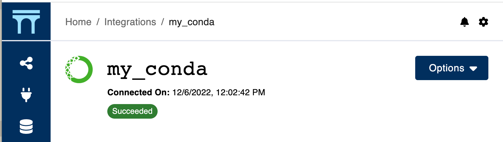

# Connecting to conda

Connecting to conda requires you to have both [conda](https://conda.io/projects/conda/en/latest/user-guide/install/index.html) and [conda-build](https://docs.conda.io/projects/conda-build/en/stable/install-conda-build.html) installed in your Aqueduct server's environment. Once installed, you can simply click the conda icon in your [integrations page](../../integrations.md) to connect.

Once connected, we will set up a few base conda environments that allows you to run [operators](../../operators.md) with different dependencies. This set up process generally takes a few minutes. You can click into the connected conda integration to view the setup progress.

<figure><figcaption></figcaption></figure>

Once we successfully set up, Aqueduct will run your new workflows using conda environments to provide better [dependencies and python version management](../../operators/using-conda.md).