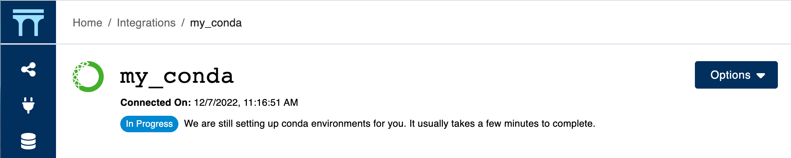

# Connecting to conda

Connecting to conda requires you to have both [conda](https://conda.io/projects/conda/en/latest/user-guide/install/index.html) and [conda-build](https://docs.conda.io/projects/conda-build/en/stable/install-conda-build.html) installed on your Aqueduct server. Once installed, you can simply click the conda icon on your [integrations page](../../integrations.md) to connect Aqueduct to conda.

Once connected, Aqueduct will go through a conda set up process which generally takes a few minutes. You can click into the connected conda integration to view the setup progress.

<figure><figcaption></figcaption></figure>

Once we have successfully set conda up, Aqueduct will run any newly created workflows using conda to provide better [dependencies and python version management](../../operators/using-conda.md).