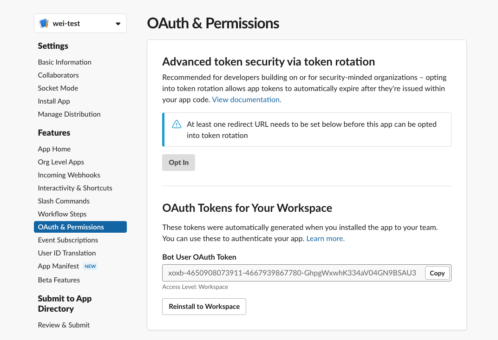

# Connecting to Slack

You can connect aqueduct to your Slack App in order to receive automated notifications on your workflow execution status. You can simply click the slack icon on your [integrations page](../../integrations.md). Aqueduct will ask for [#Bot token](connecting-to-slack#setting-up-slack-app), [#channels](connecting-to-slack#configuring-channels), and [#workflow](connecting-to-slack#configuring-global-workflow-settings) information to connect to an email integration.

## Setting up Slack App
To connect Aqueduct to slack to recieve slack notifications, you would first need to set up your own Slack App. You can follow these steps to create one:
* Go to [Slack Apps management page](https://api.slack.com/apps).
* Hit **Create New App** button.
<figure><figcaption></figcaption></figure>

* Select **Create from manifest** on the dialog.
* Select a workspace you would like to enable notification.
* Choose **yaml** and copy over the following content to the manifest. You can change **name** and **display_name** fields. This step sets up minimum required permissions and configurations for this app. You can add additional settings once the creation is done.
    ```yaml 
    display_information:
        name: my-aqueduct-bot
    features:
    bot_user:
        display_name: my-aqueduct-bot
        always_online: false
    oauth_config:
    scopes:
        bot:
        - channels:join
        - chat:write
        - chat:write.public
        - channels:read
    settings:
    org_deploy_enabled: false
    socket_mode_enabled: false
    token_rotation_enabled: false
    ```
* Once created, you will enter the app's management page. Click **Install to Workspace** and follow instructions. This completes the Slack App setup.
* You can also use an existing app. Our minimum permission requirements are: `channels:join`, `chat:write`, `chate:write.public`, and `channels:read`.
* Once the setup is done, you can provide the bot token to Aqueduct when adding the integration. To access the bot token:
    * Select your app in [slack apps management page](https://api.slack.com/apps).
    * From the left menu bar, select **OAuth & Permissions**.
    * In **OAuth Tokens for Your Workspace** section, copy **Bot User OAuth Token** to provide it to Aqueduct.
    <figure><figcaption></figcaption></figure>
## Configuring Channels
Aqueduct supports sending slack notifications to a list of channels. To do so, simply put all channels (without the leading `#`) as a comma-separated-list in the **Channels** section.

## Configuring Default Workflow Settings
You can configure the default behavior on how the notification applies to all workflows. If you choose to enable the notification, you also need to select levels at which you would like to be notified. You can also modify this setting in your account settings page.

For individual workflows where you would like to be notified differently, you can override this default settings in [workflow settings tab](../../workflows/editing-a-workflow.md).