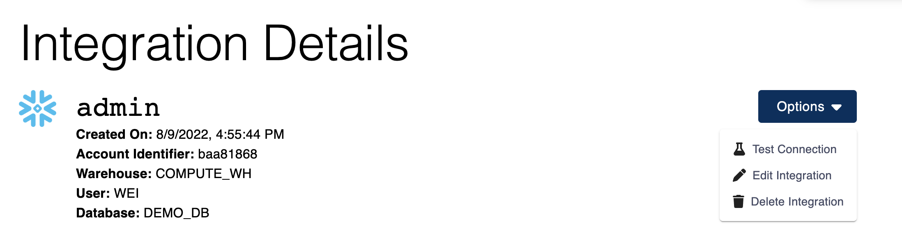
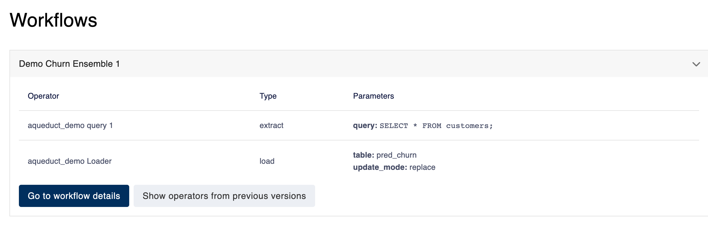

# Managing Integrations

You can connect new integrations and view all the integrations you've connected to Aqueduct by navigating to the integrations page from the sidebar.

You can click on the logo for each integration to add a new integration — see the relevant documentation for more details — and click on a previously connected integration to see its configuration. &#x20;

### Integration Information

At top of the integration details page. You can view basic information about this integration. The `Options` menu allows you to [test your integration connection](guide.md#test-your-integration-connection), [edit the integration](guide.md#editing-an-integration), or [delete the integration](guide.md#deleting-an-integration).&#x20;

<figure><figcaption></figcaption></figure>

### Test Your Integration Connection

In the `Options` menu, you can test-connect an integration to verify if it's currently available. This is especially helpful to confirm whether your credentials are expired.

### Editing an Integration

In the `Options` menu, you can edit an integration to update its name and credentials. The changes will propagate to all existing workflows using this integration. Before you make changes, we recommend checking the [workflows section](guide.md#viewing-workflows-using-an-integration) to verify that all workflows using this integration will continue to work properly.

Certain fields are protected from editing on a per-integration basis. For example, `host` and `database` fields for relational databases. To make changes on these fields, you will need to follow a migration process:

1. Create a new integration.
2. Perform any necessary data migration in your integration.
3. [Update your workflows](../workflows/editing-a-workflow.md) to use the new integration.


The reason certain fields are protected is because Aqueduct cannot verify whether a modified integration will continue to work as expected for all workflows.


### Deleting an Integration

If you don't have any workflows using an integration, you can delete that integration from the `Options` menu. Otherwise, you will need to [delete all workflows using this integration](../workflows/deleting-a-workflow.md) first. You can refer to the [workflows section](guide.md#viewing-workflows-using-an-integration) to see a list of all workflows using this integration.

For **relational databases**, in the `Preview` section, you can view tables stored in this integration. You can also get a preview of each table by typing the table name in the dropdown menu. You can find more details [here](broken-reference) on viewing data in integration.&#x20;

### Viewing Workflows Using an Integration

The `Workflows` section gives you an overview of all workflows using this integration. For each workflow, you can view details about all operators on this integration, including those from previous versions.

Before you [edit an integration](guide.md#editing-an-integration), we recommend you verify that all the workflows depending on this integration will continue to function correctly. Before [deleting this integration](guide.md#deleting-an-integration), you will need to verify that no workflows are using this integration.&#x20;

<figure><figcaption></figcaption></figure>
