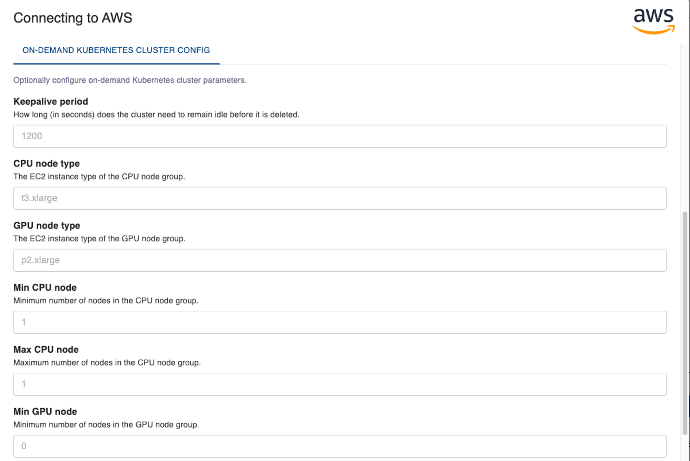

# On-demand AWS EKS Clusters

The on-demand Kubernetes compute engine allows you to run workflows on an autoscaling [AWS EKS](https://aws.amazon.com/eks/) cluster. Aqueduct manages the entire lifecycle of the cluster, from creation to autoscaling to deletion.

## When to use it

* You need cloud computing resources (CPU, GPU, RAM, disk) to run your workflow.
* You don’t want the chore of creating and managing a Kubernetes cluster yourself.
* You want the cluster to autoscale: adding more compute resources as the demand goes up and scaling down (even to 0!) as the workload drops.

## How to use it

### Registering an AWS Integration

On the UI’s “Integrations” page, under the “Cloud” section, click “AWS” and input your AWS credentials. This can be done via either entering the access keys or specifying the path to your AWS credentials file on your Aqueduct server.

<figure><figcaption></figcaption></figure>

You can also complete the registration step via the SDK as follows:

```python
from aqueduct import Client

client = Client()
client.connect_integration(name="aws", service="AWS", config={
		"config_file_path": "~/.aws/credentials",
    "config_file_profile": "default",
})
```

The AWS account must have the full set of permissions to create, manage, and delete an EKS cluster. See the [FAQ](#faqs) below about how to ensure this.

Upon successful registration, you will see the following integration entries on the UI’s Integrations page:

<figure><figcaption></figcaption></figure>

The second entry (`aws`) corresponds to the cloud provider account information you entered, and the first entry (`aws:aqueduct_ondemand_k8s`) is generated by Aqueduct internally to track the state of the Aqueduct-managed EKS cluster.

### Running a workflow

Below is a code snippet that deploys a workflow that runs on the on-demand Kubernetes cluster. As you can see, this is almost identical to running workflows with a regular Kubernetes integration. The only difference being we need to get a handle to the on-demand Kubernetes integration via `ondemand_k8s = client.integration("aws").k8s` and set the `engine` field of the `op` decorator to `ondemand_k8s.name()`. In the future, we will add support for more on-demand cloud computing engines, so stay tuned for things like `ondemand_spark = client.integration("aws").spark`🙂

```python
from aqueduct import Client, op

client = Client()
ondemand_k8s = client.integration("aws").k8s

@op(
    engine=ondemand_k8s.name(),
    requirements=[],
)
def run_on_cpu():
    return "This operator only requires CPU to run."

@op(
    engine=ondemand_k8s.name(),
    requirements=[],
    resources={
        'gpu_resource_name': 'nvidia.com/gpu',
    }
)
def run_on_gpu():
    return "This operator requires GPU to run."

cpu_artifact = run_on_cpu()
gpu_artifact = run_on_gpu()

client.publish_flow(
		name="workflow_with_ondemand_k8s",
		artifacts=[cpu_artifact, gpu_artifact],
)
```

### Under the hood

When a workflow execution request comes in that uses the on-demand Kubernetes cluster, if the cluster is in the terminated status, Aqueduct uses Terraform to create the cluster before serving the request. This process can take 15-18 minutes, and the SDK will notify you that your request is waiting for the cluster to create before executing.

The cluster has a default keepalive period of 20 minutes, meaning that Aqueduct keeps the cluster running until it has been idle for over 20 minutes. This parameter is configurable (more on the next section). When the cluster is in the running status, workflows can be scheduled immediately onto the cluster without experiencing the cluster creation overhead.

After the keepalive period is exceeded, Aqueduct uses Terraform to delete the cluster and destroy all resources to save cost.

## Configuring Cluster Parameters

The Aqueduct-managed EKS cluster has two node groups: a CPU node group which manages a pool of CPU instances, and a GPU node group which manages a pool of GPU instances. The cluster autoscaler adjusts the size of each node group based on the load. Note that as we move the feature out of beta, we will make the number of node groups configurable and support multiple node types within a node group. Currently, we allow customizing the following configuration parameters and provides sensible defaults:

```python
variable "keepalive" {
  description = "How long (in seconds) does the cluster need to remain idle before it is deleted."
  default     = 1200 // 20 minutes
  type        = number
}

variable "cpu_node_type" {
  description = "The EC2 instance type of the CPU node group"
	default     = "t3.xlarge"
  type        = string
}

variable "min_cpu_node" {
  description = "Minimum number of nodes in the CPU node group"
  default     = 1
  type        = number
}

variable "max_cpu_node" {
  description = "Maximum number of nodes in the CPU node group"
  default     = 1
  type        = number
}

variable "gpu_node_type" {
  description = "The EC2 instance type of the GPU node group."
  default     = "p2.xlarge"
  type        = string
}

variable "min_gpu_node" {
  description = "Minimum number of nodes in the GPU node group"
  default     = 0
  type        = number
}

variable "max_gpu_node" {
  description = "Maximum number of nodes in the GPU node group"
  default     = 1
  type        = number
}
```

These parameters can be customized when registering the integration via both the UI and the SDK:

<figure><figcaption></figcaption></figure>

```python
from aqueduct import Client

client = Client()
client.connect_integration(name="aws", service="AWS", config={
		"config_file_path": "~/.aws/credentials",
    "config_file_profile": "default",
		"k8s": {
        "keepalive": 1800,
				"max_cpu_node": 10,
    }
})
```

You can also update the configuration via the SDK after registration:

```python
from aqueduct import Client, op

client = Client()
ondemand_k8s = client.integration("aws").k8s
ondemand_k8s.update(config_delta={
		"keepalive": 1800,
		"max_cpu_node": 10,
})
```

## Other APIs

Please refer to our [SDK API documentation](https://docs.aqueducthq.com/api-reference/sdk-reference/package-aqueduct/package-aqueduct.integrations/aqueduct.integrations.dynamic_k8s_integration) for other APIs supported by `ondemand_k8s`.

## FAQs

**Q: How do I know if my AWS account has the full set of permissions to create, manage, and delete an EKS cluster?**

A: Unfortunately, AWS does not enable us to check if an AWS account has sufficient permissions to create a full AWS cluster. However, when running into permission errors, Aqueduct surfaces which permissions are missing and will ask you to add the missing permissions to your AWS account.

**Q: Is there an existing IAM role or policy that has all the required permissions for Aqueduct to create an EKS cluster?**

A: No. AWS doesn’t provide a managed policy that grants the permissions for creating EKS clusters, so you will need to create a policy yourself. To the best of our knowledge, the following actions need to be allowed against all resources:

```python
ec2/AllocateAddress
ec2/AssociateRouteTable
ec2/AttachInternetGateway
ec2/AuthSecurityGroupEgress
ec2/AuthSecurityGroupIngress
ec2/CreateInternetGateway
ec2/CreateLaunchTemplate
ec2/CreateNatGateway
ec2/CreateRoute
ec2/CreateRouteTable
ec2/CreateSecurityGroup
ec2/CreateSubnet
ec2/CreateVpc
ec2/DescribeAddresses
ec2/DescribeAvailabilityZones
ec2/DescribeInternetGateways
ec2/DescribeLaunchTemplateVersions
ec2/DescribeLaunchTemplates
ec2/DescribeNatGateways
ec2/DescribeNetworkAcls
ec2/DescribeRouteTables
ec2/DescribeSecurityGroups
ec2/DescribeSubnets
ec2/DescribeVpcAttribute
ec2/DescribeVpcClassicLink
ec2/DescribeVpcClassicLinkDnsSupport
ec2/DescribeVpcs
ec2/DetachInternetGateway
ec2/DisassociateAddress
ec2/DisassociateRouteTable
ec2/DeleteInternetGateway
ec2/DeleteLaunchTemplate
ec2/DeleteNatGateway
ec2/DeleteRoute
ec2/DeleteRouteTable
ec2/DeleteSecurityGroup
ec2/DeleteSubnet
ec2/DeleteVpc
ec2/RevokeSecurityGroupEgress
ec2/RevokeSecurityGroupIngress
ec2/ModifySubnetAttribute
ec2/ModifyVpcAttribute
eks/CreateCluster
eks/CreateNodegroup
eks/DescribeCluster
eks/DescribeNodegroup
eks/DeleteCluster
eks/DeleteNodegroup
iam/AttachRolePolicy
iam/CreateOpenIDConnectProvider
iam/CreatePolicy
iam/CreateRole
iam/DeleteOpenIDConnectProvider
iam/DeletePolicy
iam/DeleteRole
iam/DeleteRolePolicy
iam/DetachRolePolicy
iam/GetOpenIDConnectProvider
iam/GetPolicy
iam/GetPolicyVersion
iam/GetRole
iam/GetRolePolicy
iam/ListAttachedRolePolicies
iam/ListInstanceProfilesForRole
iam/ListPolicyVersions
iam/ListRolePolicies
iam/PutRolePolicy
kms/CreateAlias
kms/CreateKey
kms/DeleteAlias
kms/DescribeKey
kms/EnableKeyRotation
kms/GetKeyPolicy
kms/GetKeyRotationStatus
kms/ListAliases
kms/ListResourceTags
kms/ScheduleKeyDeletion
logs/CreateLogGroup
logs/DeleteLogGroup
logs/DescribeLogGroups
logs/ListTagsForResource
logs/PutRetentionPolicy
sts/GetCallerIdentity
```
