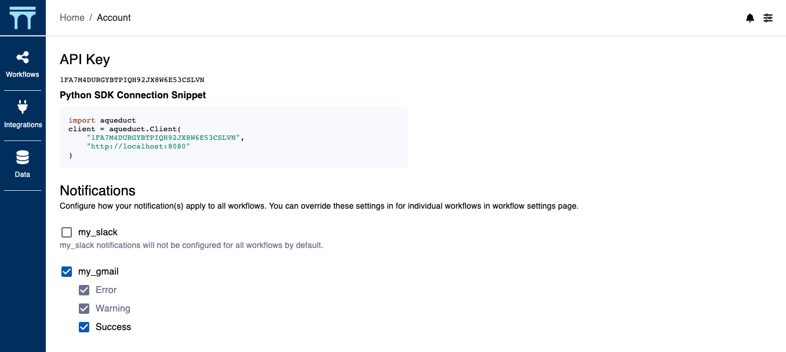

# Email

You can connect Aqueduct to your email account in order to receive automated notifications on your workflow execution status. You can simply click the email icon on your [integrations page](broken-reference). Aqueduct will ask for [#the sender address](connecting-to-email.md#configuring-the-sender-address), [#receivers](connecting-to-email.md#configuring-receivers), and [#the severity level](connecting-to-email/#configuring-default-notification-settings) at which to send email alerts.

## Configuring the Sender Address

You need to provide an email account for Aqueduct to send notifications on your behalf. Please pick the appropriate section based on your email provider:

* [Gmail](connecting-to-email.md#gmail)
* [Microsoft Exchange](connecting-to-email.md#microsoft-exchange) If your email provider is not listed above, you can check with your email provider to provide the following information to Aqueduct. Aqueduct will use this information to send email on your behalf:
* Host: The SMTP server address, excluding the port.
* Port: The SMTP server port.
* Sender Address: The account identifier to sign-in, typically the email address.
* Password: The credentials to the above account, typically the log-in password.

### Gmail

In order to use a Gmail address to send notifications, you will first need to create an application password by following these steps:

* Go to your Google account's [security management](https://myaccount.google.com/security) page.
* Go to **Signing in to Google** section.
* Select **App passwords**.
* Select **Generate** and create the password.

<figure><figcaption></figcaption></figure>

Once you have the application password ready, you can connect Aqueduct to this account with the following information:

* Host: `smtp.gmail.com`
* Port: 587
* Sender Address: Your Gmail account address (e.g. myemail@gmail.com).
* Password: Your gmail account's **Application password** created following above steps.

### Microsoft Exchange

You can connect Aqueduct to your Microsoft Exchange email to send notifications with the following information:

* Host: `smtp.office365.com`
* Port: 587
* Sender Address: Your Office 365 address (e.g. myemail@mydomain.com).
* Password: Your Office 365 password.

## Configuring Receivers

Aqueduct supports sending notifications to multiple receivers. To do so, simply put all receivers' email addresses as a comma-separated-list in the **Receivers** section.

## Configuring Default Notification Settings

You can configure the default behavior for each notification provider. If you choose to receive notifications by default, you will need to configure the severity level at which you would like to be notified — a lower severity level will automatically select more sever options along with it. For example, selecting warning-level notifications will automatically also give you error-level notifications.

You can modify these settings later on using the Aqueduct settings page.

<figure><figcaption></figcaption></figure>

You can customize these settings on a per-workflow basis as well.

<figure><figcaption></figcaption></figure>
