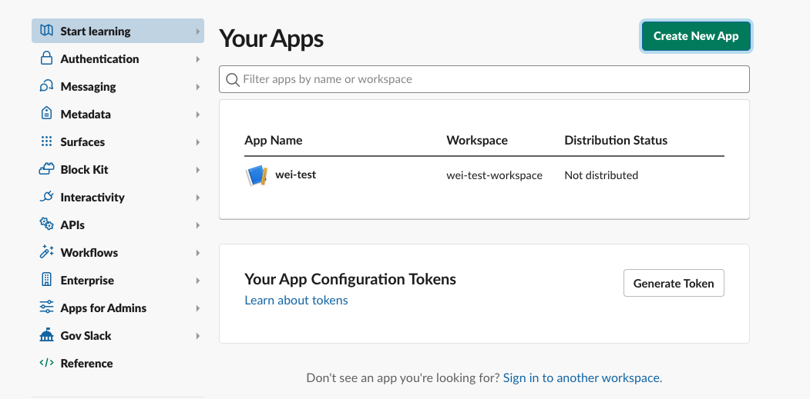

# Connecting to Slack

You can connect Aqueduct to your Slack workspace in order to receive automated notifications on your workflow execution status. You can simply click the Slack icon on your [integrations page](../integrations/adding-an-integration/README.md). Aqueduct will ask for [#the bot token](connecting-to-slack#setting-up-slack), [#channels](connecting-to-slack#configuring-channels), and [#the severity level](connecting-to-slack#configuring-default-notification-settings) at which to send slack alerts.

## Setting up Slack
To connect Aqueduct to Slack to recieve notifications, you would first need to set up your own Slack App. You can follow these steps to create one:
* Go to [Slack Apps management page](https://api.slack.com/apps).
* Hit **Create New App**.
<figure><figcaption></figcaption></figure>

* Select **Create from manifest** on the dialog.
* Select the workspace where you'd like to receive notifications.
* Choose **yaml** and copy over the following content to the manifest. You can change **name** and **display_name** fields. This step sets up minimum required permissions and configurations for this app.
    ```yaml 
    display_information:
        name: my-aqueduct-bot
    features:
        bot_user:
            display_name: my-aqueduct-bot
            always_online: false
    oauth_config:
        scopes:
            bot:
            - channels:join
            - chat:write
            - chat:write.public
            - channels:read
    settings:
        org_deploy_enabled: false
        socket_mode_enabled: false
        token_rotation_enabled: false
    ```
* Once created, you will enter the app's management page. Click **Install to Workspace** and follow the instructions. This completes the Slack App setup.
* Once the setup is done, you can provide the bot token to Aqueduct when adding the integration. To access the bot token:
    * Select your app in [Slack Apps management page](https://api.slack.com/apps).
    * From the left menu bar, select **OAuth & Permissions**.
    * In **OAuth Tokens for Your Workspace** section, copy **Bot User OAuth Token** to provide it to Aqueduct.
    <figure><figcaption></figcaption></figure>
## Configuring Channels
Aqueduct supports sending Slack notifications to a list of channels. To do so, simply put all channels (without the leading `#`) as a comma-separated-list in the **Channels** section.

## Configuring Default Notification Settings
You can configure the default behavior for each notification provider. If you choose to receive notifications by default, you will need to configure the severity level at which you would like to be notified — a lower severity level will automatically select more sever options along with it. For example, selecting warning-level notifications will automatically also give you error-level notifications.

You can modify these settings later on using the Aqueduct settings page.
<figure><figcaption></figcaption></figure>

You can customize these settings on a per-workflow basis as well.
<figure><figcaption></figcaption></figure>