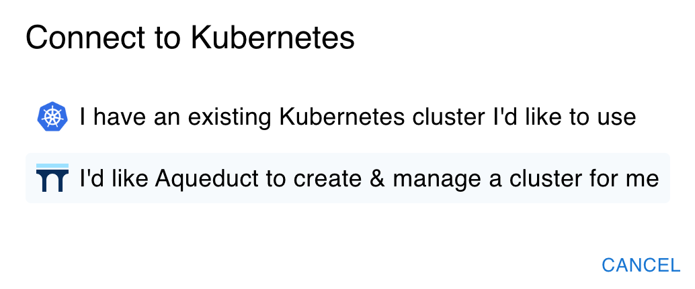
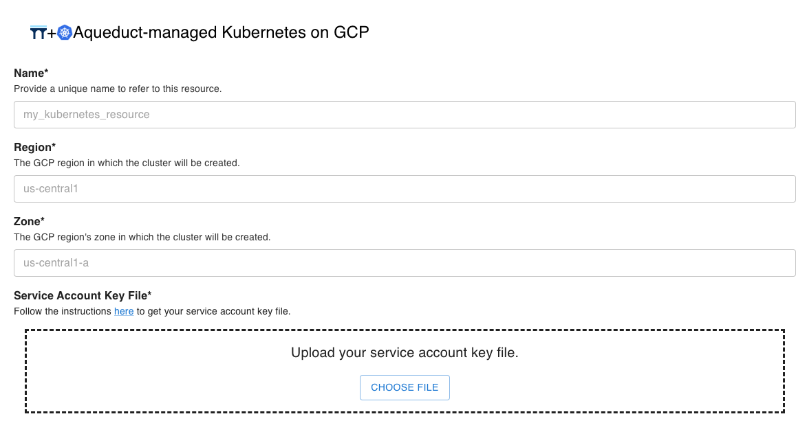
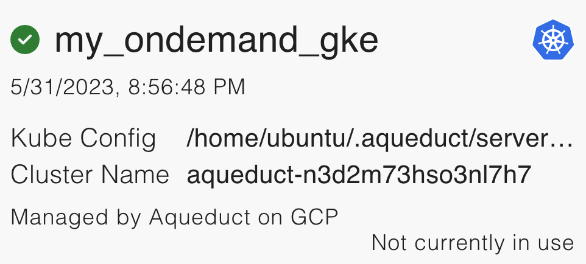
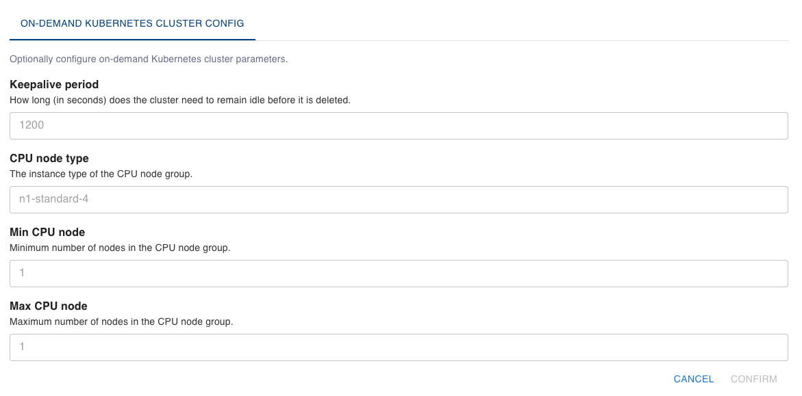

# On-Demand GKE Clusters

The on-demand GKE resource allows you to run workflows on an autoscaling [GKE](https://cloud.google.com/kubernetes-engine) cluster. Aqueduct manages the entire lifecycle of the cluster, from creation to autoscaling to deletion.

## When to use it

* You need cloud computing resources (CPU, GPU, RAM, disk) to run your workflow.
* You don’t want the chore of creating and managing a Kubernetes cluster yourself.
* You want the cluster to autoscale: adding more compute resources as the demand goes up and scaling down (even to 0!) as the workload drops.

## How to use it

### Registering an on-demand Kubernetes Resource on GCP

On the UI’s “Resources" page, under "Add new Resources", click on the "Kubernetes" icon and select
"I'd like Aqueduct to create & manage a cluster for me".

<figure><figcaption></figcaption></figure>

Then click on the "GCP" icon and input your GCP credentials.

<figure><figcaption></figcaption></figure>

You can also complete the registration step via the SDK as follows:

```python
from aqueduct import Client

client = Client()
client.connect_resource(name="my_ondemand_gke", service="Kubernetes", config={
    "cloud_provider": "GCP",
    "gcp_config": {
        "region": "us-central1",
        "zone": "us-central1-a",
        "service_account_key_path": "<PATH/TO/key.json>"
    },
})
```

The GCP service account must have the full set of permissions to create, manage, and delete a GKE cluster. See the [FAQ](on-demand-gke-clusters.md#faqs) below about how to ensure this.

Upon successful registration, you will see the following resource entries on the UI’s Resources page:

<figure><figcaption></figcaption></figure>

### Running a workflow

Below is a code snippet that deploys a workflow that runs on the on-demand Kubernetes cluster.

```python
from aqueduct import Client, op

client = Client()

@op(
    engine="my_ondemand_gke",
    requirements=[],
)
def run_on_cpu():
    return "This operator only requires CPU to run."

@op(
    engine="my_ondemand_gke",
    requirements=[],
    resources={
        'gpu_resource_name': 'nvidia.com/gpu',
    }
)
def run_on_gpu():
    return "This operator requires GPU to run."

cpu_artifact = run_on_cpu()
gpu_artifact = run_on_gpu()

client.publish_flow(
		name="workflow_with_ondemand_k8s",
		artifacts=[cpu_artifact, gpu_artifact],
)
```

### Under the hood

When a workflow execution request comes in that uses the on-demand Kubernetes cluster, if the cluster is in the terminated status, Aqueduct uses Terraform to create the cluster before serving the request. This process can take 15-18 minutes, and the SDK will notify you that your request is waiting for the cluster to create before executing.

The cluster has a default keepalive period of 20 minutes, meaning that Aqueduct keeps the cluster running until it has been idle for over 20 minutes. This parameter is configurable (more on the next section). When the cluster is in the running status, workflows can be scheduled immediately onto the cluster without experiencing the cluster creation overhead.

After the keepalive period is exceeded, Aqueduct uses Terraform to delete the cluster and destroy all resources to save cost.

## Configuring Cluster Parameters

The Aqueduct-managed GKE cluster has one CPU node pool. The cluster autoscaler adjusts the size of the node pool based on the load. We also plan to ship GPU node pool support in the future. Currently, we allow customizing the following configuration parameters and provides sensible defaults:

```
variable "keepalive" {
  description = "How long (in seconds) does the cluster need to remain idle before it is deleted."
  default     = 1200 // 20 minutes
  type        = number
}

variable "cpu_node_type" {
  description = "The EC2 instance type of the CPU node group"
	default     = "t3.xlarge"
  type        = string
}

variable "min_cpu_node" {
  description = "Minimum number of nodes in the CPU node group"
  default     = 1
  type        = number
}

variable "max_cpu_node" {
  description = "Maximum number of nodes in the CPU node group"
  default     = 1
  type        = number
}
```

These parameters can be customized when registering the resource via both the UI and the SDK:

<figure><figcaption></figcaption></figure>

```python
from aqueduct import Client

client = Client()
client.connect_resource(name="my_ondemand_gke", service="Kubernetes", config={
    "cloud_provider": "GCP",
    "gcp_config": {
        "region": "us-central1",
        "zone": "us-central1-a",
        "service_account_key_path": "<PATH/TO/key.json>"
    },
    "cluster_config": {
        "keepalive": 1800,
        "max_cpu_node": 10,
    }
})
```

You can also update the configuration via the SDK after registration:

```python
from aqueduct import Client, op

client = Client()
ondemand_gke = client.resource("my_ondemand_gke")
ondemand_gke.update(config_delta={
		"keepalive": 1800,
		"max_cpu_node": 10,
})
```

## Other APIs

Please refer to our [SDK API documentation](https://docs.aqueducthq.com/api-reference/sdk-reference/package-aqueduct/package-aqueduct.resources/aqueduct.resources.dynamic\_k8s) for other APIs supported by `ondemand_gke`.

## FAQs

**Q: Is there an existing role or policy that has all the required permissions for Aqueduct to create a GKE cluster?**

A: Yes. Assigning the following roles to your service account during [creation](https://cloud.google.com/iam/docs/service-accounts-create) gives it the full set of permissions to create, manage, and delete a GKE cluster:

* `Compute Network Admin`
* `Kubernetes Engine Admin`
* `Service Account User`

**Q: How do I know if my GCP service account has the full set of permissions to create, manage, and delete the cluster?**

A: Unfortunately, GCP does not enable us to check if a service account has sufficient permissions to create a full GKE cluster. However, when running into permission errors, Aqueduct surfaces which permissions are missing and will ask you to add the missing permissions to your GCP account.
