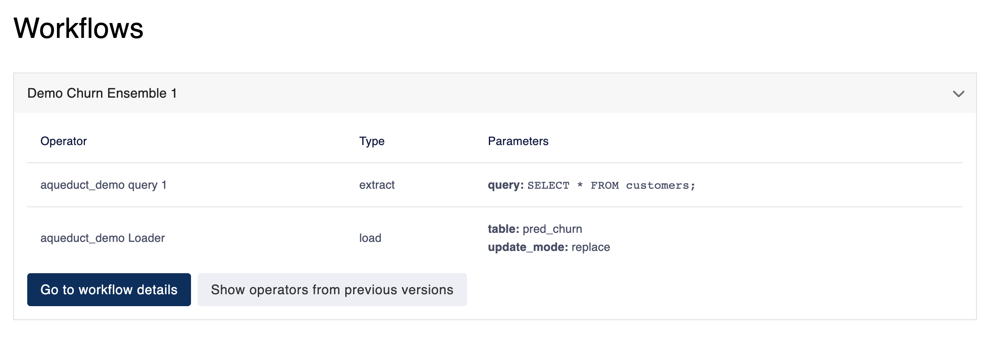

# Managing Resources

You can connect new resources and view all the resources you've connected to Aqueduct by navigating to the resources page from the sidebar.

You can click on the logo for each resource to add a new resource — see the relevant documentation for more details — and click on a previously connected resource to see its configuration. &#x20;

### Resource Information

At top of the resource details page. You can view basic information about this resource. The `Options` menu allows you to [test your resource connection](guide.md#test-your-resource-connection), [edit the resource](guide.md#editing-an-resource), or [delete the resource](guide.md#deleting-an-resource).&#x20;

<figure><figcaption></figcaption></figure>

### Test Your Resource Connection

In the `Options` menu, you can test-connect an resource to verify if it's currently available. This is especially helpful to confirm whether your credentials are expired.

### Editing an Resource

In the `Options` menu, you can edit an resource to update its name and credentials. The changes will propagate to all existing workflows using this resource. Before you make changes, we recommend checking the [workflows section](guide.md#viewing-workflows-using-an-resource) to verify that all workflows using this resource will continue to work properly.

Certain fields are protected from editing on a per-resource basis. For example, `host` and `database` fields for relational databases. To make changes on these fields, you will need to follow a migration process:

1. Create a new resource.
2. Perform any necessary data migration in your resource.
3. [Update your workflows](../workflows/editing-a-workflow.md) to use the new resource.


The reason certain fields are protected is because Aqueduct cannot verify whether a modified resource will continue to work as expected for all workflows.


### Deleting an Resource

If you don't have any workflows using an resource, you can delete that resource from the `Options` menu. Otherwise, you will need to [delete all workflows using this resource](../workflows/deleting-a-workflow.md) first. You can refer to the [workflows section](guide.md#viewing-workflows-using-an-resource) to see a list of all workflows using this resource.

For **relational databases**, in the `Preview` section, you can view tables stored in this resource. You can also get a preview of each table by typing the table name in the dropdown menu. You can find more details [here](broken-reference) on viewing data in resource.&#x20;

### Viewing Workflows Using an Resource

The `Workflows` section gives you an overview of all workflows using this resource. For each workflow, you can view details about all operators on this resource, including those from previous versions.

Before you [edit an resource](guide.md#editing-an-resource), we recommend you verify that all the workflows depending on this resource will continue to function correctly. Before [deleting this resource](guide.md#deleting-an-resource), you will need to verify that no workflows are using this resource.&#x20;

<figure><figcaption></figcaption></figure>
