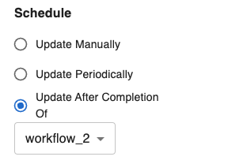

# Cascading Workflows

This guide will walk you through how to deploy a workflow that runs after another workflow. If a source workflow is provided, the target workflow will be triggered at the end of each successful run of the source workflow. Each workflow can have at most one source workflow. Aqueduct will prevent any cycles from forming amongst cascading workflows.

### Defining Source Workflow from the SDK

The source workflow can be set when publishing a workflow from the SDK. The complete documentation for publishing a workflow from the SDK can be found [here](./creating-a-workflow.md#publishing-a-workflow).

The argument `source_workflow` in `client.publish_workflow(...)` allows you to set the source workflow.

### Defining Source Workflow from the UI

The source workflow can be modified from the UI from the workflow settings page. 

<figure><figcaption></figcaption></figure>