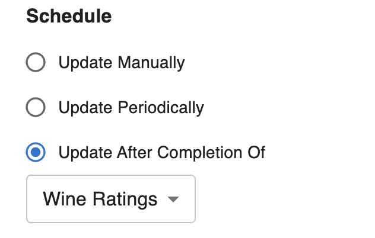

# Cascading Workflows

This guide will walk you through how to deploy a workflow that runs after another workflow. 

If a source workflow is provided, the target workflow will be triggered at the end of each successful run of the source workflow. If the source workflow does not complete successfully, the target workflow will not be triggered. Each workflow can have at most one source workflow. Aqueduct will return an error (on the SDK and UI) to prevent you from forming a cycle amongst cascading workflow. 

### Defining Source Workflow from the SDK

The source workflow can be set when publishing a workflow from the SDK. The complete documentation for publishing a workflow from the SDK can be found [here](./creating-a-workflow.md#publishing-a-workflow).

The `source_workflow` argument in the following code snippet allows you to set the source workflow:

```python
workflow_a = client.flow('8fb25dc4-62ed-44a3-872d-c3ff988c8dd3')

# source_flow can be a Flow object, workflow name, or workflow ID
flow = client.publish_flow(name='workflow_b', 
                           artifacts=[data],
                           source_workflow=source_flow)
```


### Defining Source Workflow from the UI

The source workflow can be modified from the UI from the workflow settings page. 

<figure><figcaption></figcaption></figure>